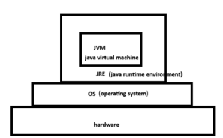
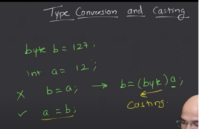
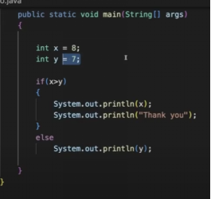
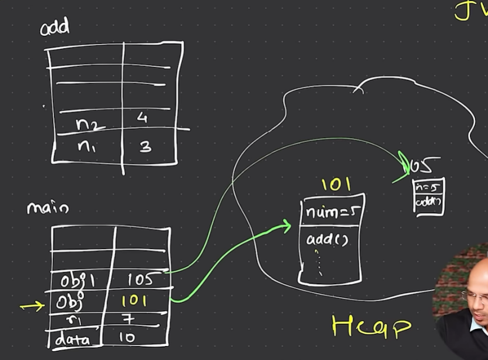

# 📦 Java Installation & Basics

## ✅ Install JDK
- Download and install the **Java Development Kit (JDK)** from Oracle’s official site.
- Prefer a **Long Term Support (LTS)** version (e.g., JDK 17 or JDK 21).
- Make sure Java is added to your system's **PATH**.

---

## 🔰 Java Overview

- **JAVA** – Developed and maintained by **Oracle**
- Described as:
  - 📚 **Lengthy**, can feel **difficult** initially
  - 🧱 **Structured**, **Readable**, and **Maintainable**
  - ⚙️ Supports **Multiple Threads**
  - 📦 Offers powerful **Collection APIs**
  - ❗ Provides **Exception Handling**
  - 🌍 **Platform Independent**:  
    **WORA** – *Write Once, Run Anywhere*  
    → Runs on any machine **with JVM installed**

---

## 💻 Running Java Code in Terminal

### ➤ Use `jshell` (Java Shell)
Run interactive Java code directly from command line:
```
jshell
```

➤ Sample Commands:
```
2 + 3
System.out.print(2);   // Note: 'S' is Capital
System.out.print("Hello world");   // Text must be in double quotes " "
```
⚠️ Always end statements with a semicolon ;

 ----------------------------------
  **JVM**: Executes bytecode on any platform. -- (Java Virtual Machine)  

  **JRE**: Includes the JVM and libraries to run the program.  -- Java Runtime Environment (JRE)

  **JDK**: Includes JRE + tools for Java development (like javac). – java development kit

-----------------------------------------

**Process :**

1 -- javac compiler :  Java source code (.java file) -> bytecode 

stores it in .class file (e.g., Hello.class)
 using command on teminal : javac Hello.java

2-- Java Virtual Machine (JVM) executes the compiled .class file by interpreting or compiling it into native machine code specific to your operating system.

Command : java Hello

-------------------------------------------
JVM : JVM is a virtual machine that runs Java bytecode (the .class files) on any platform.
JVM is build for a particular OS (linux , mac , windows)

JVM understands byte code not java 

Javac is a Compiler (java -> byte code) 

--------------

---------------------------------------------
There can be many java files in a single projects …but execution of file by JVM will start from 1  file that user specifies And that should contain main …below code
```
public static void main (String a[])
```
-------------------------------------------------
File name should exactly same as class name . e.g. class Hello ….Hello.java   ( case sensitive ) 

You need to ensure that the JRE version matches or exceeds the version of the JDK used to compile the program. ( to run the prog correctly)

If such error arise , Solution is :

1) Recompile with the Older Java Version:

javac -version

javac -target 1.8 Hello.java

java Hello 

-------------------------------------------
 Run code  ( many methods) : 

1 . Run with "Run Code" Button (Easiest)
Install the "Code Runner" extension (from Extensions panel).
```
2. javac fileName.java
 Java fileName
```

--------------------------------------------------

 **VARIABLE data type**  

1) primitive – int (byte,short,int,long) , float(double) , character , Boolean

Int – 4 bytes 

Long – 8 bytes 

Short -2 bytes 

Byte -1 byte :   -2e7 to 2e7-1 i.e. -128 to 127

Float – 4 , double  - 8

---------------------------------
flloat num = 5.6f    (NEED TO MENTION f)

double num=5.6

 char c= ‘k’    ( ‘ ’ only , no “ “ )

boolean   ( only true/false not 0/1)

boolean t= 1;  //error

boolean t= false; // 😊 

-------------------------------- 
Count zero : 
```
int num = 10_00_00_000;
System.out.println(num); 
```
-> o/p :  100000000

------------------------

----------------------------------

++ , -=  , %  , -- , +=  , == (compare) , != , < , > ,= ( assign) , >=,<=
& , | , ! (NOT) , 
Boolean r= 4>5  // false ( not 0 )

------------------------------------
 **CONDTIONALS ( IF /ELSE )  --- TERNARY OPERATOR**

Break , continue  , switch 


-------------------------------------
3 . CLASS OBJECT
-----------------------------------------
4. STACK HEAP  

-----------------
Stiring pool

String buffer

Static 

Class load 