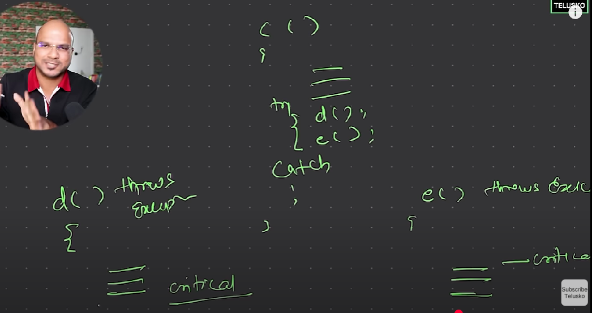

| Feature      | Handling    | Ducking       |
| ------------ | ----------- | ------------- |
| Keyword      | `try-catch` | `throws`      |
| Who handles? | Same method | Caller method |
| Control      | Immediate   | Passed upward |

----
 

 if a method c is calling method d and e

 then instead of having try catch block in both d & e 

 keep it in c only (do the exception handling in c for d & e )

nd write 'throws exception' keyword in declaration of d & e ...directing to call its caller method to handle exception

this is called ducking 

<!-- ---------  -->
in Demo4Throws.java
 
we can't write throws exception with main method cz  
main method is called by JVM nd we if we ask JVM to handle exception  
nd it will stop code execution if execption is detected 

<!-------------------->
we can have to ways for exeption handling in such case :  
1 . write ..throws exception both in main & in that method  
2. write try nd catch block in main & throws in the method whose execption is to be handled 
 
// 1 is not a feasible option
