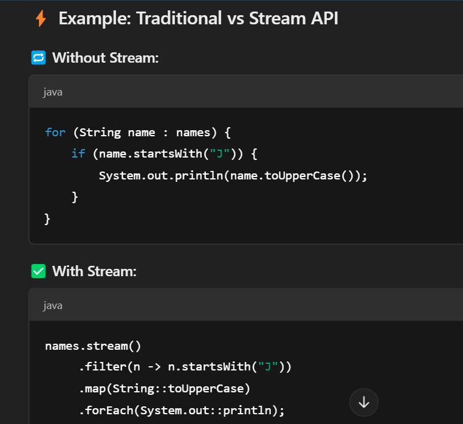

**stream**
A Stream is not a data structure like a list or array. 
It’s a pipeline to process data

✅ What Can Streams Do?
filter() – pick certain elements
map() – change each element
forEach() – do something with each
collect() – save the result (like into a List)
sorted(), limit(), distinct() – more goodies

Streams are one-time use only (like a one-way ticket)
make code shorter and cleaner.

**stream API**  
--introduced in Java 8
--IT process collections of data (like List, Set, etc.) in functional Programming Style (using lambda expressions and method references.)

--Reduces the boilerplate code in loops and conditional statements.
--cleaner, readable, and often more efficient
--Chainable Operations :combine multiple operations (filter, map, reduce) in a single pipeline.

 
