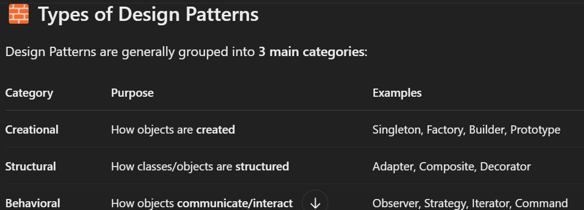

Design Patterns are reusable solutions to common software design problems

 they’re not code, but they help you structure your code better, cleaner, and smarter.

  help with issues : code duplication, unnecessary complexity, and scalability challenges etc

provide solutions to common software design problems that occur repeatedly.

Singleton 🧍‍♀️

Factory 🏭

Prototype 🧬

Builder 🧱

Observer 👀

Strategy 🧠

**🎯 WHY do we need them?**
Because in the real world, you'll face problems like:

“How do I ensure only one object is created?”

“How do I create objects without hardcoding?”

“How do I decouple parts of my system?”

